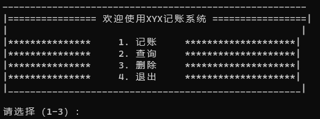
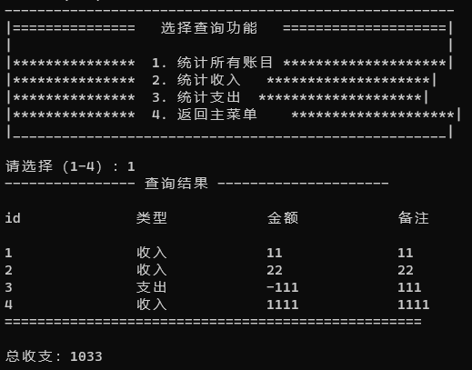
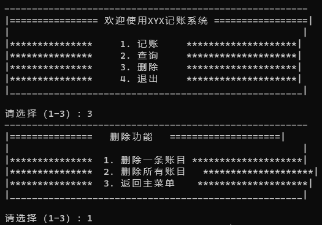

# account-book
This is a command-line interface based home accounting software which utilizes file storage to manage data.  
It has implemented functions such as searching, adding, deleting data and so forth. 
The software adopts a command-line design and leverages file systems to store information. Key features involve querying, creating and removing accounting records from the data files. 
Further improvements are still needed in the future, such as using a database to store data instead of files for better organization, fast querying and flexibility in data management. 

